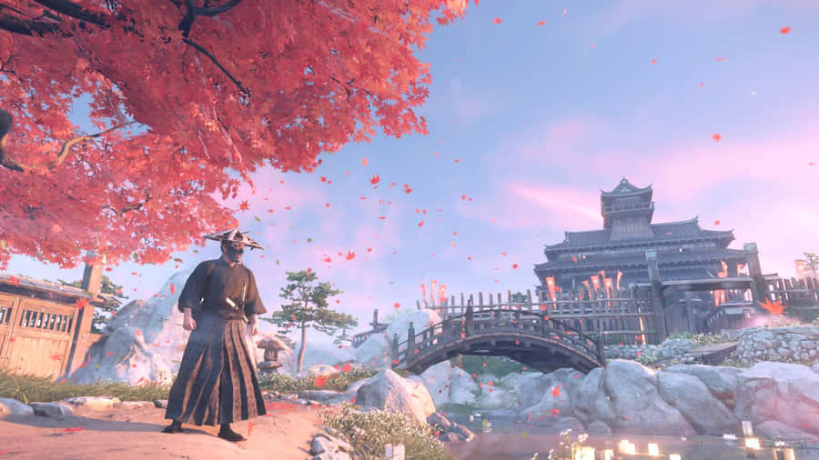
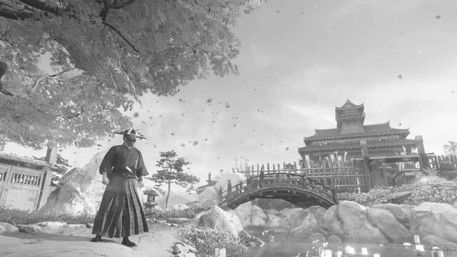
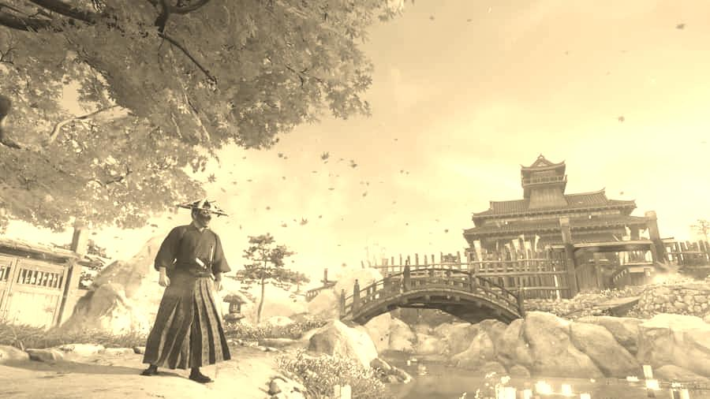
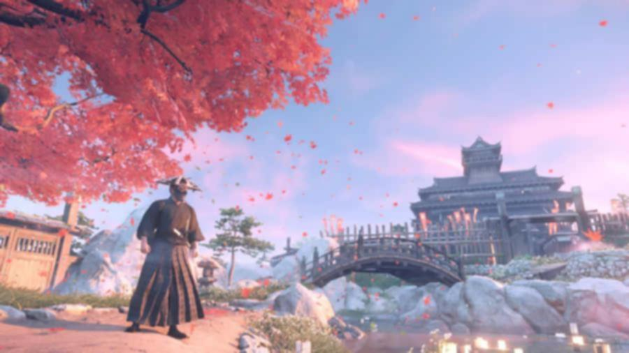

# Image Filtering Engine

## Overview
The Image Filtering Engine is a modular, Object-Oriented Java CLI application that allows users to apply mathematical transformations to standard image files. It loads image data into a custom 2D matrix structure, processes the pixels using algorithmic filters (Grayscale, Sepia, Box Blur), and outputs the newly modified image file. 

## Features
*   **Modular Strategy Pattern:** Filters are implemented via a common interface, allowing dynamic algorithm selection at runtime.
*   **Custom Pixel Mapping:** Reads uncompressed image bytes and models them into a proprietary `ImageMatrix` data structure.
*   **Multiple Filter Algorithms:** Supports standard Grayscale averaging, weighted Sepia tone, and 3x3 Box Blur convolution.
*   **Graceful Error Handling:** Includes `try-catch` validation for file I/O, preventing crashes on invalid user inputs or corrupt files.

## Project Structure

Image Filtering Engine/
├── .vscode/
│   └── settings.json
├── bin/                      # Compiled Java .class files
├── lib/                      # External libraries (Empty)
├── Screenshots/              # Sample inputs and filtered outputs
│   ├── BLUR.jpg
│   ├── GRAY.jpg
│   ├── SEPIA.jpg
│   └── TSUSHIMA.jpg
├── src/                      # Core Java source code
│   ├── BlurFilter.java       # Blur strategy implementation
│   ├── GrayscaleFilter.java  # Grayscale strategy implementation
│   ├── SepiaFilter.java      # Sepia strategy implementation
│   ├── ImageIOHandler.java   # File loading and saving module
│   ├── ImageMatrix.java      # 2D grid holding Pixel objects
│   ├── ImageTransformer.java # Strategy Pattern Interface
│   ├── Main.java             # Entry point and terminal CLI
│   └── Pixel.java            # Entity class for RGB values
├── .gitattributes
├── README.md                 # Setup and execution instructions
└── statement.md              # Problem statement and project scope

## Screenshots

**Original Image (TSUSHIMA)**


**Grayscale Filter Applied**


**Sepia Filter Applied**


**Blur Filter Applied**


## Technologies Used
*   **Language:** Java (JDK 8 or higher)
*   **Libraries:** Java Standard Library (`javax.imageio`, `java.awt.image`, `java.io`, `java.util`)
*   **Architecture:** Object-Oriented Programming (OOP)
*   **Version Control:** Git / GitHub

## Steps to Install & Run
1. Clone this repository to your local machine.
2. Ensure you have the Java Development Kit (JDK) installed.
3. Open a terminal and navigate to the `src` directory of the project:
   ```bash
   cd "Image Filtering Engine/src"